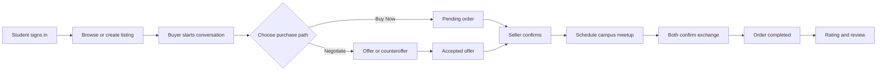
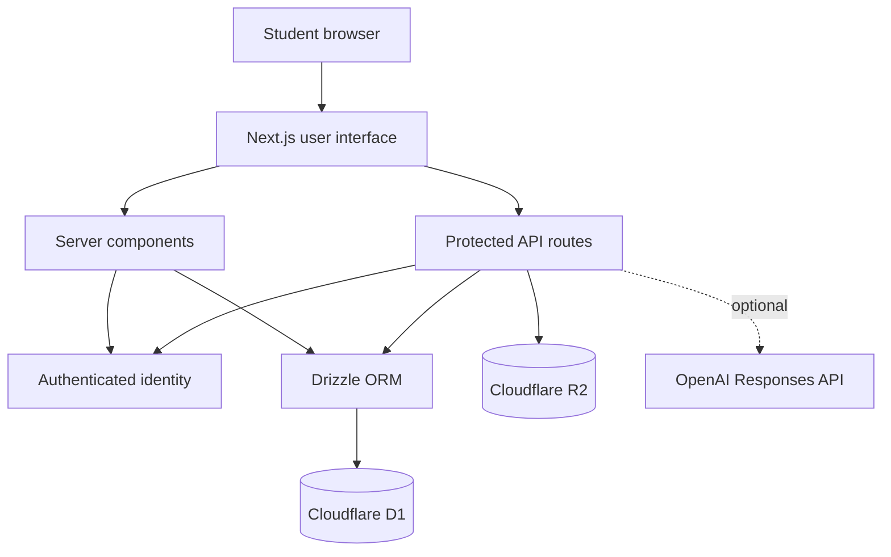
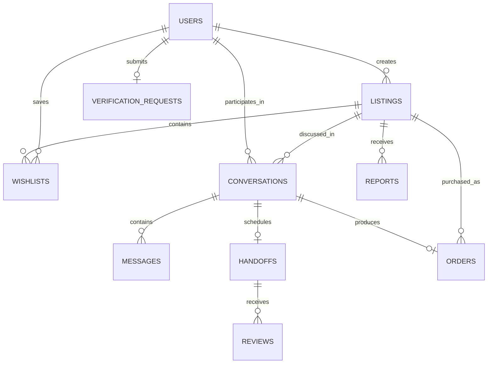

<div align="center">

# CampusKart

### A trusted, AI-powered marketplace built for campus communities

Buy, sell, negotiate, and complete safe in-person exchanges—all in one full-stack application.

[](https://campuskart.dineshsixdsvv.chatgpt.site)
[](https://nextjs.org/)
[](https://www.typescriptlang.org/)
[](https://www.cloudflare.com/)

[Live Application](https://campuskart.dineshsixdsvv.chatgpt.site) · [Features](#key-features) · [Architecture](#system-architecture) · [Local Setup](#local-development) · [API](#api-overview)

</div>

---

## About the Project

CampusKart replaces unstructured college buy-and-sell groups with a dedicated marketplace for textbooks, calculators, cycles, electronics, lab equipment, and hostel essentials.

Students can publish products, discover nearby deals, negotiate inside private conversations, place orders, schedule safe campus handoffs, and build trust through verification and post-trade reviews. The project also includes a listing-grounded AI shopping assistant and a role-protected moderation dashboard.

> The marketplace is publicly browsable. Authentication is required for selling, buying, messaging, wishlists, verification, administration, and order history.

## Why CampusKart?

| Common campus-marketplace problem | CampusKart solution |
| --- | --- |
| Products disappear inside crowded group chats | Searchable, categorized, persistent listings |
| Price negotiation is unstructured | Offers, counteroffers, acceptance, rejection, and withdrawal states |
| Buyers cannot track a purchase | Complete order lifecycle and buyer/seller history |
| Unknown sellers reduce trust | Campus verification, ratings, reviews, and reporting |
| Meetup details are scattered across messages | Structured campus handoff scheduling and two-sided completion |
| Students struggle to compare deals | Listing-grounded AI recommendations and fair-offer guidance |

## Key Features

### Marketplace and Listings

- Responsive public marketplace with search, category filters, and price sorting
- Product details with condition, price, original price, seller, and pickup location
- Seller-owned create, read, update, and delete operations
- JPG, PNG, and WebP uploads stored in Cloudflare R2
- Draft, active, reserved, sold, and moderated listing states

### Authentication and Student Trust

- Sign in with ChatGPT through the hosting platform
- Automatic authenticated student-profile creation
- Server-side ownership and participant authorization
- Campus-verification requests using college email and register number
- Admin approval or rejection with verified-seller badges

### Chat, Offers, and Negotiation

- Private conversation per buyer and listing
- Persistent near-real-time chat with automatic polling
- Unread-message tracking and actionable notification centre
- Structured offers, counteroffers, acceptance, rejection, and withdrawal
- Automatic product reservation after an accepted offer

### Orders and Safe Handoffs

- Buy Now orders and automatic orders from accepted offers
- Unique order numbers and separate buyer/seller histories
- Seller confirmation and cancellation controls
- Campus meetup proposal and confirmation
- Two-sided exchange completion before a listing becomes sold
- Post-trade ratings and reviews

### AI Shopping Assistant

- Recommendations grounded in currently active CampusKart listings
- Budget-based product discovery and comparisons
- Fair-offer estimates and negotiation-message drafting
- Campus trade-safety guidance
- OpenAI Responses API integration with a deterministic marketplace-aware fallback

### Administration and Moderation

- Role-protected trust-and-safety dashboard
- Student, listing, order, verification, and report statistics
- Verification-request review workflow
- Duplicate-resistant product reporting
- Resolve, dismiss, or hide unsafe listings

## Product Workflow



## Technology Stack

| Layer | Technology |
| --- | --- |
| Frontend | React 19, Next.js 16 App Router, TypeScript, CSS |
| Backend | Next.js route handlers and server components |
| Runtime | Vinext, Vite, Cloudflare Workers |
| Database | Cloudflare D1 (SQLite) |
| ORM and migrations | Drizzle ORM, Drizzle Kit |
| File storage | Cloudflare R2 |
| Authentication | Sign in with ChatGPT and trusted identity headers |
| AI | OpenAI Responses API with local fallback logic |
| Validation | Server-side validation, authorization, and ownership checks |
| Deployment | OpenAI Sites on Cloudflare infrastructure |

## System Architecture



### Architecture Highlights

- Public reads and protected write operations are separated at the route level.
- Every user-owned operation is authorized on the server.
- D1 stores structured relational data; R2 stores uploaded image bytes.
- Database changes are versioned through Drizzle migrations.
- Chat polling keeps the current serverless architecture simple and reliable.
- The assistant remains useful when no external AI key is configured.

## Database Model



Core tables: `users`, `listings`, `wishlists`, `conversations`, `messages`, `handoffs`, `reviews`, `reports`, `orders`, and `verification_requests`.

## API Overview

| Endpoint | Methods | Purpose | Access |
| --- | --- | --- | --- |
| `/api/listings` | `GET`, `POST` | Browse or create listings | Public / authenticated |
| `/api/listings/:id` | `PATCH`, `DELETE` | Manage seller-owned listings | Seller |
| `/api/listing-image` | `GET` | Deliver R2 product images | Public |
| `/api/conversations` | `POST` | Start or reopen a conversation | Authenticated |
| `/api/conversations/:id/messages` | `GET`, `POST` | Read messages, chat, or make offers | Participant |
| `/api/offers/:id` | `PATCH` | Accept, reject, withdraw, or counter | Participant |
| `/api/orders` | `GET`, `POST` | View history or place a Buy Now order | Authenticated |
| `/api/orders/:id` | `PATCH` | Confirm or cancel an order | Buyer / seller |
| `/api/conversations/:id/handoff` | `GET`, `POST`, `PATCH` | Manage the campus exchange | Participant |
| `/api/wishlist` | `GET`, `POST` | Read or toggle saved products | Authenticated |
| `/api/verification` | `GET`, `POST` | Read or submit campus verification | Authenticated |
| `/api/notifications/read` | `POST` | Mark received activity as read | Authenticated |
| `/api/assistant` | `POST` | Get listing-grounded shopping guidance | Authenticated |
| `/api/reports` | `POST` | Report a marketplace listing | Authenticated |
| `/api/admin/verifications/:id` | `PATCH` | Review student verification | Admin |
| `/api/admin/reports/:id` | `PATCH` | Moderate marketplace reports | Admin |

## Security Decisions

- Authentication is validated server-side for every protected route.
- Listing mutations verify seller ownership.
- Conversations and offers verify buyer/seller participation.
- Authentication redirects accept only same-origin relative paths.
- Uploaded images are restricted by MIME type and size.
- User input is normalized and validated before database writes.
- Database access uses Drizzle rather than string-built SQL.
- Runtime keys remain in hosted environment settings and are never committed.
- The public repository contains only placeholder environment values.

## Local Development

### Prerequisites

- Node.js `22.13.0` or newer
- npm
- Cloudflare-compatible D1 and R2 bindings for persistent features

### 1. Clone and install

```bash
git clone https://github.com/Dinesh10981/CampusKart.git
cd CampusKart
npm install
```

### 2. Configure environment variables

```bash
cp .env.example .env.local
```

| Variable | Required | Description |
| --- | --- | --- |
| `OPENAI_API_KEY` | No | Enables generative AI assistant responses |
| `OPENAI_MODEL` | No | OpenAI model used by the assistant |
| `ADMIN_EMAILS` | For admin access | Comma-separated administrator emails |

Never commit `.env.local` or a real API key.

### 3. Start development

```bash
npm run dev
```

Authentication headers and production D1/R2 resources are injected by the hosting environment. The public marketplace can run locally, while authenticated persistent flows require equivalent local bindings or a supported deployment.

### 4. Validate the project

```bash
npm run lint
npm run build
```

### Database migrations

```bash
npm run db:generate
```

Always inspect generated SQL inside `drizzle/` before deployment.

## Available Scripts

| Command | Description |
| --- | --- |
| `npm run dev` | Start the Vinext/Vite development server |
| `npm run lint` | Run ESLint checks |
| `npm run build` | Build and validate the production Worker artifact |
| `npm test` | Build and run rendered-HTML tests |
| `npm run db:generate` | Generate Drizzle migrations |
| `npm run validate:artifact` | Validate an existing deployment artifact |

## Project Structure

```text
CampusKart/
├── app/
│   ├── admin/                    # Trust and safety dashboard
│   ├── api/                      # Backend route handlers
│   ├── assistant/                # AI shopping assistant
│   ├── dashboard/                # Profile and listing management
│   ├── listings/[id]/            # Product details and purchase actions
│   ├── messages/                 # Inbox and negotiation chat
│   ├── notifications/            # Activity centre
│   └── orders/                   # Buyer and seller history
├── db/                           # Drizzle queries and domain workflows
├── drizzle/                      # Versioned D1 migrations
├── public/                       # Static assets
├── scripts/                      # Build and validation scripts
├── tests/                        # Automated tests
├── worker/                       # Cloudflare Worker entry point
└── .openai/hosting.json          # Hosted Site configuration
```

## Milestone History

| Milestone | Delivered capability |
| --- | --- |
| 1 | Responsive marketplace and product discovery |
| 2 | Authentication, student profiles, and D1 database |
| 3 | Product CRUD and image uploads |
| 4 | Chat, offers, counteroffers, and negotiation |
| 5 | Wishlists, notifications, handoffs, reviews, reports, and moderation |
| 6 | Orders, buyer/seller history, and AI shopping assistant |
| 7 | Campus verification, admin controls, notification actions, and production hardening |

## Resume Summary

> Built and publicly deployed a production-ready campus marketplace using Next.js, React, TypeScript, Cloudflare D1, R2, and Drizzle ORM. Implemented authenticated product CRUD, private negotiation, order lifecycle management, safe campus handoffs, AI-assisted shopping, campus verification, notifications, and role-protected moderation.

## Roadmap

- Email ownership verification with one-time codes
- Push and email notifications
- Cursor-based pagination for large marketplace datasets
- WebSocket or managed-event chat delivery
- Expanded authenticated integration and end-to-end test coverage

## Author

**Dinesh**  
B.Tech — Artificial Intelligence and Machine Learning  
Kongu Engineering College

---

<div align="center">

Built as a full-stack portfolio project for software engineering and AI/ML placement opportunities.

**[View the live CampusKart application](https://campuskart.dineshsixdsvv.chatgpt.site)**

</div>
