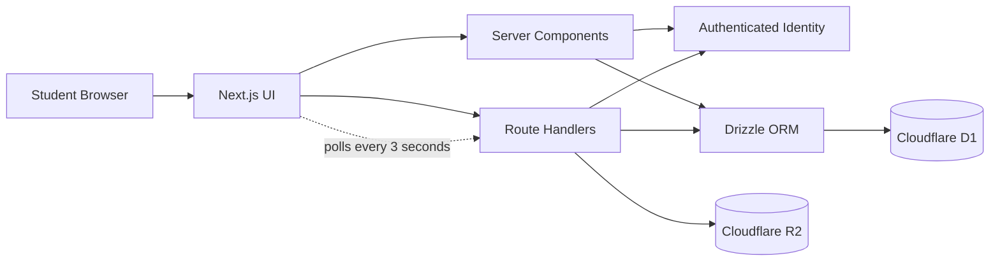
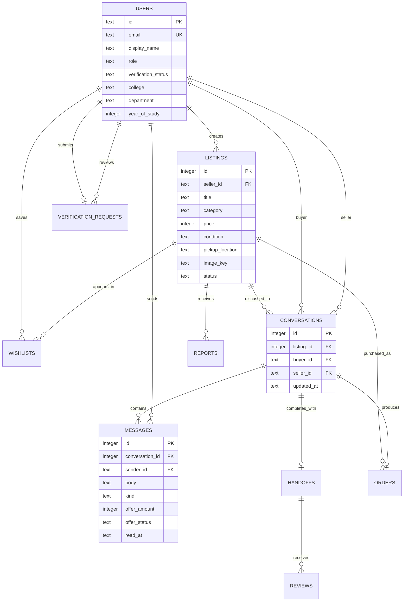

# CampusKart

> A trusted campus marketplace where college students can list products, discover nearby deals, chat with sellers, and negotiate prices safely.

[](https://campuskart.dineshsixdsvv.chatgpt.site)
[](https://nextjs.org/)
[](https://react.dev/)
[](https://www.typescriptlang.org/)
[](https://www.cloudflare.com/)

**Live application:** [campuskart.dineshsixdsvv.chatgpt.site](https://campuskart.dineshsixdsvv.chatgpt.site)

> The marketplace is public to browse. Signing in is required for selling, buying, messaging, saved items, verification, and order history.

## Overview

CampusKart solves a common college problem: buying and selling used textbooks, calculators, cycles, electronics, lab equipment, and hostel essentials usually happens through crowded messaging groups with poor search, no structured listings, and no safe negotiation flow.

The application gives students one focused marketplace with authenticated profiles, persistent product listings, image uploads, private conversations, unread-message tracking, and structured price offers.

This repository contains the complete full-stack implementation through **Milestone 7**.

## Key Features

### Marketplace

- Responsive campus-focused landing page
- Product discovery by category
- Detailed listing pages with seller and pickup information
- Listing condition, current price, original price, and availability status
- Student-friendly interface optimized for desktop and mobile

### Authentication and Profiles

- Sign in with ChatGPT through the hosting platform
- Protected dashboard and write operations
- Automatic student profile creation after authentication
- Profile details for college, department, and year of study
- Safe same-origin redirects after sign-in and sign-out

### Product Listing CRUD

- Create, view, update, and delete listings
- Upload and replace product images
- Cloud object storage for listing photos
- Draft, active, reserved, and sold listing states
- Seller ownership checks on protected operations
- Input and image validation

### Chat, Offers, and Negotiation

- Private buyer-seller conversations for each listing
- Persistent message history
- Near-real-time updates through three-second polling
- Conversation inbox with unread-message counts
- Send structured price offers inside the chat
- Accept, reject, withdraw, or counter an offer
- Automatically mark a listing as reserved when an offer is accepted
- Participant-only access to conversations and messages
- Prevent sellers from opening a buyer conversation with their own listing

### Trust, Handoff, and Moderation

- Persistent wishlists and a saved-items dashboard
- Search by product, category, or pickup location with price sorting
- In-app activity centre for incoming messages, offers, and trade updates
- Safe campus meetup scheduling after an accepted offer
- Two-sided exchange confirmation before an item is marked sold
- Post-trade student ratings and reviews
- Listing reporting with duplicate-report protection
- Role-protected moderation centre for resolving reports or hiding unsafe listings

### Orders and AI Shopping Assistant

- Buy Now ordering with offline payment at the campus handoff
- Unique order numbers and buyer/seller purchase history
- Seller confirmation and order cancellation controls
- Order tracking across pending, confirmed, meetup scheduled, completed, and cancelled states
- Automatic order creation when a negotiated offer is accepted
- CampusKart AI assistant grounded in active marketplace listings
- Budget recommendations, product comparisons, fair-offer estimates, negotiation drafts, and safety guidance
- OpenAI Responses API support with a reliable marketplace-aware fallback when an API key is not configured

### Production Readiness

- Direct JPG, PNG, and WebP product uploads backed by Cloudflare R2
- Student campus-verification requests using college email and register number
- Role-protected administrator approval and rejection workflow
- Marketplace health dashboard with student, listing, order, verification, and report totals
- Actionable notification centre with unread state and mark-all-read control
- Configurable administrator allowlist through a server-side environment variable
- Responsive trust-and-safety interfaces for desktop and mobile

## Milestones

| Milestone | Scope | Status |
| --- | --- | --- |
| 1 | Marketplace frontend and responsive product discovery | Complete |
| 2 | Authentication, student profiles, and database integration | Complete |
| 3 | Product listing CRUD and image uploads | Complete |
| 4 | Chat, offers, counteroffers, and negotiation workflow | Complete |
| 5 | Wishlist, notifications, handoffs, reviews, reports, and moderation | Complete |
| 6 | Orders, buyer/seller history, tracking, and AI shopping assistant | Complete |
| 7 | Image storage, actionable notifications, campus verification, admin trust dashboard, and production hardening | Complete |

## Technology Stack

| Layer | Technology |
| --- | --- |
| Frontend | React 19, Next.js 16 App Router, TypeScript, CSS |
| Backend | Next.js route handlers and server components |
| Runtime | Vinext, Vite, Cloudflare Workers |
| Database | Cloudflare D1 (SQLite) |
| ORM | Drizzle ORM and Drizzle Kit |
| File storage | Cloudflare R2 |
| Authentication | Sign in with ChatGPT / trusted identity headers |
| Validation | Server-side input, authorization, and image checks |
| Quality | ESLint, TypeScript production build, Node test runner |
| Deployment | OpenAI Sites on Cloudflare infrastructure |

## Architecture



### Request Flow

1. Public visitors can browse the marketplace and listing details.
2. Protected actions read the authenticated user identity supplied by the hosting layer.
3. The application creates or retrieves the corresponding student profile.
4. Server components and API routes use Drizzle ORM to access D1.
5. Product images are stored in R2 and delivered through the listing-image route.
6. Chat clients poll the messages endpoint every three seconds for new activity.

## Database Design



### Important Data Rules

- A buyer can have only one conversation per listing.
- Only the buyer and seller can read or write to their conversation.
- Listing sellers control changes to their own products.
- Offer actions are restricted according to the sender and recipient.
- Deleting a listing removes its dependent wishlist, conversation, and message records.

## API Reference

| Method | Endpoint | Purpose | Authentication |
| --- | --- | --- | --- |
| `GET` | `/api/listings` | Return public listings | Public |
| `POST` | `/api/listings` | Create a listing with an optional image | Required |
| `PATCH` | `/api/listings/:id` | Update a seller-owned listing | Required |
| `DELETE` | `/api/listings/:id` | Delete a seller-owned listing | Required |
| `GET` | `/api/listing-image` | Serve a stored listing image | Public |
| `GET` | `/api/profile` | Return the current student profile | Required |
| `PATCH` | `/api/profile` | Update the current student profile | Required |
| `POST` | `/api/conversations` | Create or reopen a listing conversation | Required |
| `GET` | `/api/conversations/:id/messages` | Read messages and mark received messages as read | Required |
| `POST` | `/api/conversations/:id/messages` | Send a message or offer | Required |
| `PATCH` | `/api/offers/:id` | Accept, reject, withdraw, or counter an offer | Required |
| `GET/POST` | `/api/wishlist` | Read or toggle saved listings | Required |
| `GET/POST/PATCH` | `/api/conversations/:id/handoff` | Read, schedule, confirm, cancel, or complete a handoff | Required |
| `POST` | `/api/reviews` | Publish a post-exchange rating | Required |
| `POST` | `/api/reports` | Report a marketplace listing | Required |
| `PATCH` | `/api/admin/reports/:id` | Moderate a report and optionally hide a listing | Admin |
| `GET/POST` | `/api/orders` | Read purchase/sales history or place a Buy Now order | Required |
| `PATCH` | `/api/orders/:id` | Confirm or cancel an order | Required |
| `POST` | `/api/assistant` | Get listing-grounded shopping guidance | Required |
| `GET/POST` | `/api/verification` | Read or submit a campus verification request | Required |
| `POST` | `/api/notifications/read` | Mark received activity as read | Required |
| `PATCH` | `/api/admin/verifications/:id` | Approve or reject campus verification | Admin |

## Project Structure

```text
campuskart/
├── app/
│   ├── api/
│   │   ├── conversations/       # Conversation and message endpoints
│   │   ├── listing-image/       # Product image delivery
│   │   ├── listings/            # Listing CRUD endpoints
│   │   ├── offers/              # Offer action endpoint
│   │   └── profile/             # Student profile endpoint
│   ├── dashboard/               # Profile and listing management
│   ├── listings/[id]/           # Product detail and contact seller
│   ├── messages/                # Inbox and negotiation chat room
│   ├── chatgpt-auth.ts          # Authentication helpers
│   ├── globals.css              # Application-wide responsive styles
│   ├── layout.tsx               # Root layout and metadata
│   └── page.tsx                 # Marketplace landing page
├── db/
│   ├── chat.ts                  # Conversation, message, and offer logic
│   ├── index.ts                 # D1 database connection
│   ├── listings.ts              # Listing queries and mutations
│   ├── profiles.ts              # Student profile persistence
│   └── schema.ts                # Drizzle database schema
├── drizzle/                     # Versioned SQL migrations
├── public/                      # Static assets
├── scripts/                     # Build and validation scripts
├── tests/                       # Automated tests
├── worker/                      # Cloudflare Worker entry point
├── drizzle.config.ts
├── vite.config.ts
└── package.json
```

## Getting Started

### Prerequisites

- Node.js `22.13.0` or newer
- npm
- A compatible Cloudflare Workers environment for database and object-storage features

The included production scripts target Linux and use `flock`, `curl`, and GNU `timeout`. The development server can still be used independently on other supported systems.

### Installation

```bash
git clone <your-repository-url>
cd campuskart
npm install
```

### Start the Development Server

```bash
npm run dev
```

Open the local URL printed by Vite.

The public marketplace can be previewed locally. Authentication headers, the production D1 database, and R2 storage are supplied by the hosting environment, so authenticated and persistent flows should be tested after configuring equivalent bindings or deploying through the supported platform.

### Optional OpenAI Assistant Configuration

The assistant always provides marketplace-aware recommendations. To enable generative responses through the OpenAI Responses API, configure these server-side environment variables:

```bash
OPENAI_API_KEY=your_project_api_key
OPENAI_MODEL=gpt-5.6
ADMIN_EMAILS=admin@college.edu
```

Never expose the API key in browser code or commit it to version control.

### Database Migrations

After changing `db/schema.ts`, generate a new migration:

```bash
npm run db:generate
```

Generated SQL is stored in `drizzle/`. Review every migration before deployment.

## Available Scripts

| Command | Description |
| --- | --- |
| `npm run dev` | Start the local Vinext/Vite development server |
| `npm run lint` | Run ESLint |
| `npm run build` | Create and validate the production Worker artifact |
| `npm test` | Build the application and run automated tests |
| `npm run validate:artifact` | Validate an existing deployment artifact |
| `npm run db:generate` | Generate Drizzle SQL migrations |

## Security and Validation

- Protected API routes reject unauthenticated requests.
- Conversation queries verify that the current user is a participant.
- Listing updates and deletion verify seller ownership.
- Offer actions verify whether the user is the proposer or recipient.
- Authentication redirects accept only safe same-origin relative paths.
- Product data is parsed and validated on the server.
- Image uploads validate type and size before object storage.
- Database queries use Drizzle ORM rather than string-built SQL.
- Runtime secrets and local environment files are excluded from version control.

## Current Real-Time Strategy

Messages refresh automatically every three seconds. This produces a responsive near-real-time experience while keeping the current architecture simple and reliable on the deployed serverless stack.

For a future high-traffic version, the polling layer can be upgraded to WebSockets or a managed real-time event service without changing the conversation and offer data model.

## Future Roadmap

- Push and email notifications
- Database-backed pagination for very large listing collections
- Email ownership verification with one-time codes
- WebSocket-based message delivery
- Automated unit, integration, and end-to-end coverage for authenticated flows

## Resume-Ready Description

**CampusKart — Full-Stack Campus Marketplace**  
Built and publicly deployed a production-ready student marketplace using Next.js, React, TypeScript, Cloudflare D1, R2, and Drizzle ORM. Implemented authenticated profiles, product CRUD, image uploads, private buyer-seller negotiation, order lifecycle tracking, listing-grounded AI shopping guidance, campus verification, notifications, and role-protected moderation.

### Suggested Resume Bullets

- Developed a responsive full-stack marketplace with authenticated student profiles, product CRUD, persistent image storage, and protected seller operations.
- Designed a relational D1/SQLite schema with Drizzle ORM for users, listings, wishlists, conversations, messages, and structured price offers.
- Implemented private buyer-seller chat with unread tracking and negotiation state transitions, automatically reserving products after accepted offers.
- Secured server routes using identity-based authorization, ownership checks, participant validation, safe redirects, and server-side input validation.
- Built a campus-verification and trust dashboard with admin approval, marketplace health metrics, report moderation, and verified-seller badges.

## Author

**Dinesh**  
B.Tech Artificial Intelligence and Machine Learning  
Kongu Engineering College

## License

This project is currently provided for educational, portfolio, and evaluation purposes. Add a standard open-source license before accepting external contributions or redistributing the application.
